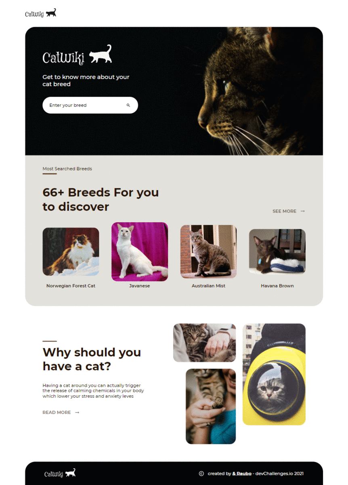

<h1 align="center">CatWiki</h1>

<div align="center">
   Solution for a challenge from  <a href="http://devchallenges.io" target="_blank">Devchallenges.io</a>.
</div>

<div align="center">
  <h3>
    <!-- <a href="https://{your-demo-link.your-domain}">
      Demo
    </a>
    <span> | </span> -->
    <a href="https://github.com/RauboLuk/CatWiki-devchallenges.io">
      Solution
    </a>
    <span> | </span>
    <a href="https://devchallenges.io/challenges/f4NJ53rcfgrP6sBMD2jt">
      Challenge
    </a>
  </h3>
</div>

<!-- TABLE OF CONTENTS -->

## Table of Contents

- [Overview](#overview)
  - [Built With](#built-with)
- [Features](#features)
- [How to use](#how-to-use)
- [Contact](#contact)
- [Acknowledgements](#acknowledgements)

<!-- OVERVIEW -->

## Overview



### Built With

- [Apollo GraphQL](https://www.apollographql.com/)
- [Create React App](https://create-react-app.dev/)
- [mongoose](https://mongoosejs.com/)
- [React](https://reactjs.org/)
- [Styled Components](https://styled-components.com/)
- [The Cat API](https://thecatapi.com/)
<!-- - [axios](https://www.npmjs.com/package/axios) -->
<!-- - [dotenv](https://www.npmjs.com/package/dotenv) -->
<!-- - [graphql](https://www.npmjs.com/package/graphql) -->
<!-- - [Material-UI](https://material-ui.com/) -->
<!-- - [MongoDB](https://www.mongodb.com/) -->
<!-- - [nodejs](https://nodejs.org/en/) -->
<!-- - [nodemon](https://www.npmjs.com/package/nodemon/) -->
<!-- - [prettier](https://www.npmjs.com/package/prettier) -->
<!-- - [use-debounce](https://www.npmjs.com/package/use-debounce) -->

## Features

This application/site was created as a submission to a [DevChallenges](https://devchallenges.io/challenges) challenge. The [challenge](https://devchallenges.io/challenges/f4NJ53rcfgrP6sBMD2jt) was to build an application to complete the given user stories:

- [x] **User story**: I can search for cat breeds and select a breed of my choice
- [x] **User story**: I can see the most popular searched cat breeds summary on the homepage
- [x] **User story**: I can see the top 10 most searched cat breeds
- [x] **User story**: I can see the breed details including description, temperament, origin, life span, adaptability, affection level, child-friendly, grooming, intelligence, health issues, social needs, stranger friendly
- [x] **User story**: I can see more photo of the breed
- [x] **User story**: On mobile, when I select the search option, a modal for breed search should pop up
- [x] **User story (optional)**: I can go to an article about cats when I click read more on Why you should have a cat section
- [x] **User story (optional)**: I can go to the top 10 cats by clicking see more in the dashboard

## How To Use

To clone and run this application, you'll need [Git](https://git-scm.com) and [Node.js](https://nodejs.org/en/download/) (which comes with [npm](http://npmjs.com)) installed on your computer.

### Run the project

CatWiki full-stack app holds two main folders `server` and `client`.
### server
create `.env` file with `MONGODB_URI`
```bash
# install packages 
cd server && npm install

# start server
npm start
```
### client
From another terminal window:
```bash
# install packages
cd client && npm install

# start React app
npm start
```

## Acknowledgements

- [Change SVG Color Using CSS Filter](https://change-svg-color.vercel.app/)
- [Put icon inside input element in a form](https://stackoverflow.com/a/917673)
- [Maintain the aspect ratio of a div with CSS](https://stackoverflow.com/a/65817448)
- [Before and After pseudo classes used with styled-components](https://stackoverflow.com/a/45871869/9185799)
- [Using Apollo Link to Handle Dependent Queries](https://www.apollographql.com/blog/using-apollo-link-to-handle-dependent-queries-f9ed9f046886/)
- [Re-render a React Component on Window Resize](https://www.pluralsight.com/guides/re-render-react-component-on-window-resize)
- [Mongoose - Increment with findOne](https://stackoverflow.com/a/16357280)
- [Store images in a MongoDB database](https://stackoverflow.com/questions/4796914/store-images-in-a-mongodb-database)
<!-- https://stackoverflow.com/a/44467274 -->

## Contact

- GitHub [@RauboLuk](https://github.com/RauboLuk)
- Stack Overflow [@RauboLuk](https://stackoverflow.com/users/9185799/rauboluk)

<!-- https://generatepress.com/forums/topic/how-can-i-draw-a-partial-line-under-text/#post-637647 -->
<!-- https://hackernoon.com/creating-simple-api-gateway-using-node-js-6d5933c214b8 -->
